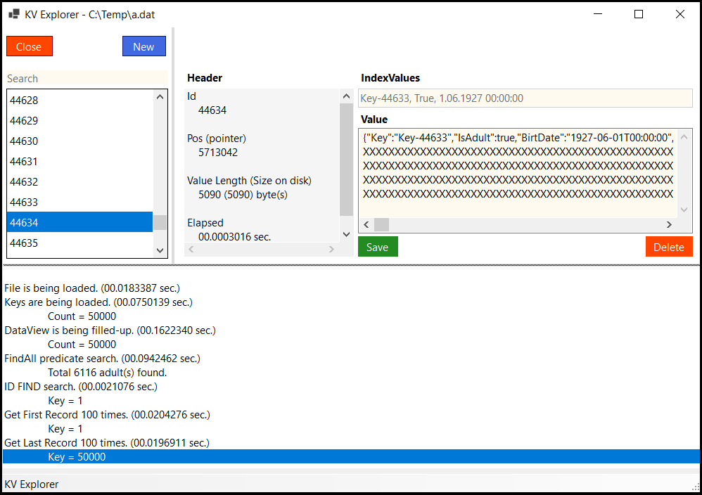

# KVCollection - A .NET Key-Value Collection Store


---

KVCollection is a small, fast and lightweight .NET Key-Value Collection. 

- Serverless
- Simple API
- 100% C# code for .NET Core in a single DLL (less than 17kb)
- Thread-safe
- ACID with full transaction support
- Data recovery after write failure (WAL log file)
- Indexed keys for fast search
- Open source and free for everyone - including commercial use
- `KV Explorer` - Nice UI for data access

## How to use KVCollection

A quick example for storing and searching documents:

```C#

public class testModel {
    public string Name;
    public int Age;
    public bool IsAdult;
    public DateTime BirthDate;
}

// Define Indexes
KeyValue.CollectionIndexer.Define<testModel>()
    .EnsureIndex(x => x.Name)
    .EnsureIndex(x => x.IsAdult)
    .EnsureIndex(x => x.BirtDate);


// Create an instance
var kc =  new KeyValue.Collection();

// Get the collection. If not exists then will be created.
kc.Open("Folder", "CollectionName");


// Insert new 50K items
for (int i = 0; i < 50000; i++)
{
    var item = new testModel();
    item.Name = "Name-" + i;
    item.Age = ((i % 90) + 1) + 10;
    item.BirtDate = new DateTime(DateTime.Now.Year - item.Age, (i % 12) + 1, 1);
    item.IsAdult = item.Age > 18;

    kvFileTyped.Add(item);
}

    
var count = kc.Count;

// get value by record ID
var item = kc.Get(25000);
// get value by first-indexed-value
var item = kc.GetByIndex("Name-50000");

// get values by filter "Adult=true && BirtDate>dt"
var dt = DateTime.Now.AddYears(-30);
var items = kc.GetAll(indexValues => (bool)indexValues[1] && (DateTime)indexValues[2] > dt)


// Update an item
kc.Update(item); // also there are different overloads


// Delete an item
kc.Delete(item);
kc.DeleteMany( new []{ item1, item2 ... itemN } );


// Insert or Update an item
kc.Upsert(item); // also there are different overloads


// Determining the row is exists or not
kc.Exists(item); // also there are different overloads


// Delete all items
kc.Truncate();


// Shrink Collection
kc.Shrink();


// Iteration all headers
foreach (var key in kc.GetHeaders())
{
    ...
}


// Iteration all items
foreach (var item in kc.GetAll<T>())
{
    // item.Header
    // item.Data
}

// Reverse Iteration all items
foreach (var item in kc.GetAll<T>( Reverse: true ))
{
    // item.Header
    // item.Data
}
    

// Close then collection
kc.Close();
```

## KV Explorer

UI to manage and visualize your data.



## Where to use?

- All desktop/web applications need to store key-value data
- Multi client application
- .Net / Asp.Net / .Net Core / Asp.Net Core


## Changelog

Change details for each release are documented in the [release notes](https://github.com/Rubic-Solutions/KVCollection/releases).


## License

[MIT](http://opensource.org/licenses/MIT)
